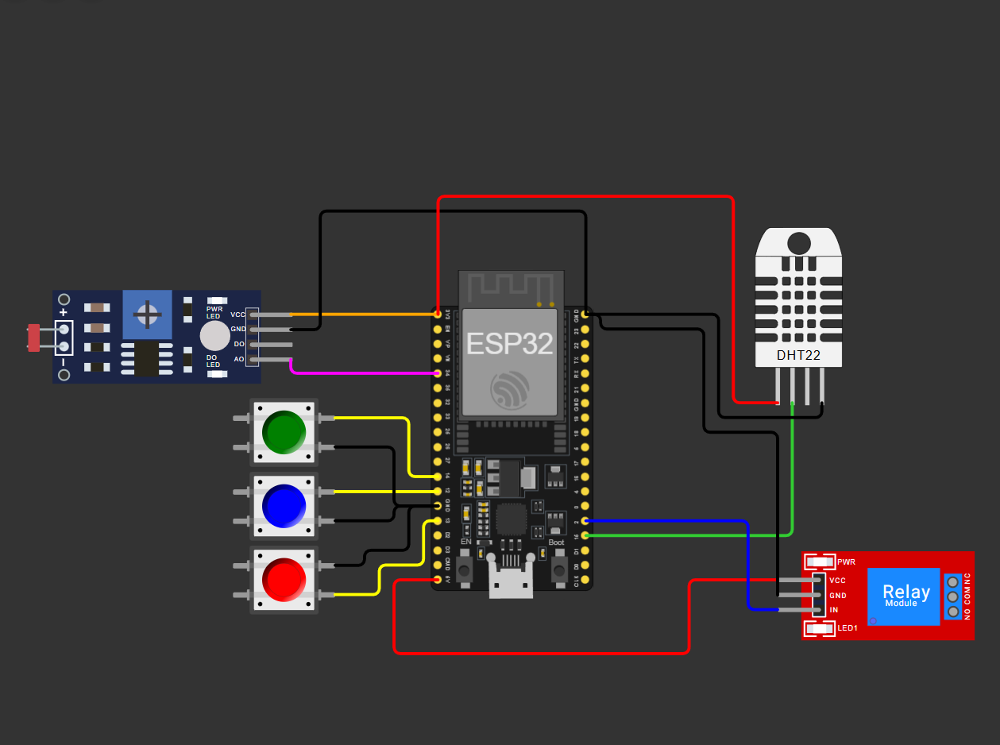

# FIAP - Faculdade de Informática e Administração Paulista

 

# FASE 2 - Sistema de monitoramento e irrigação automatizada para o cultivo de **Figo-da-Índia (Prickly Pear)** utilizando ESP32.

## Joao Otavio Moraes rm573227

## 👨‍🎓 Integrantes: 
- <a href="www.linkedin.com/in/joao-otavio-moraes-16273a26b">Joao Otavio Moraes</a>

## 👩‍🏫 Professores:
### Tutor(a) 
- <a href="https://www.linkedin.com/in/nicollycrsouza/">Nicolly Candida</a>
### Coordenador(a)
- <a href="https://www.linkedin.com/company/inova-fusca">Andre Godoi</a>

## 📜 Descrição

- **Monitoramento de Umidade:** Utiliza o sensor DHT22 para simular a umidade do solo.
- **Controle de pH:** Utiliza um sensor LDR para simular a variação analógica do pH (escala 0-14).
- **Indicadores NPK:** Três botões que representam os níveis de Nitrogênio, Fósforo e Potássio.
- **Irrigação Automática:** Acionamento de um relé (Bomba d'água) quando a umidade cai abaixo de 25%.

## 📁 Estrutura de pastas

Dentre os arquivos e pastas presentes na raiz do projeto, definem-se:

- <b>.github</b>: Nesta pasta ficarão os arquivos de configuração específicos do GitHub que ajudam a gerenciar e automatizar processos no repositório.

- <b>assets</b>: aqui estão os arquivos relacionados a elementos não-estruturados deste repositório, como imagens.

- <b>config</b>: Posicione aqui arquivos de configuração que são usados para definir parâmetros e ajustes do projeto.

- <b>document</b>: aqui estão todos os documentos do projeto que as atividades poderão pedir. Na subpasta "other", adicione documentos complementares e menos importantes.

- <b>scripts</b>: Posicione aqui scripts auxiliares para tarefas específicas do seu projeto. Exemplo: deploy, migrações de banco de dados, backups.

- <b>src</b>: Todo o código fonte criado para o desenvolvimento do projeto ao longo das 7 fases.

- <b>README.md</b>: arquivo que serve como guia e explicação geral sobre o projeto (o mesmo que você está lendo agora).

## 🔧 Como executar o código

1. Acesse o [Wokwi.com](https://wokwi.com).
2. Monte o circuito conforme a tabela de pinagem.
3. Cole o código do arquivo `sketch.ino`. localizado na pasta 'FASE2/FarmTech Solutions/'
4. Inicie a simulação.

   print do projeto da pasta /assets 

link da aplicacao completa: https://wokwi.com/projects/461710056233454593

video do funcionamento: https://youtu.be/RGs8VOmBkcE

## 🗃 Histórico de lançamentos

19/04/2026
    *

## 📋 Licença

<a property="dct:title" rel="cc:attributionURL" href="https://github.com/agodoi/template">MODELO GIT FIAP</a> por <a rel="cc:attributionURL dct:creator" property="cc:attributionName" href="https://fiap.com.br">Fiap</a> está licenciado sobre <a href="http://creativecommons.org/licenses/by/4.0/?ref=chooser-v1" target="_blank" rel="license noopener noreferrer" style="display:inline-block;">Attribution 4.0 International</a>.

