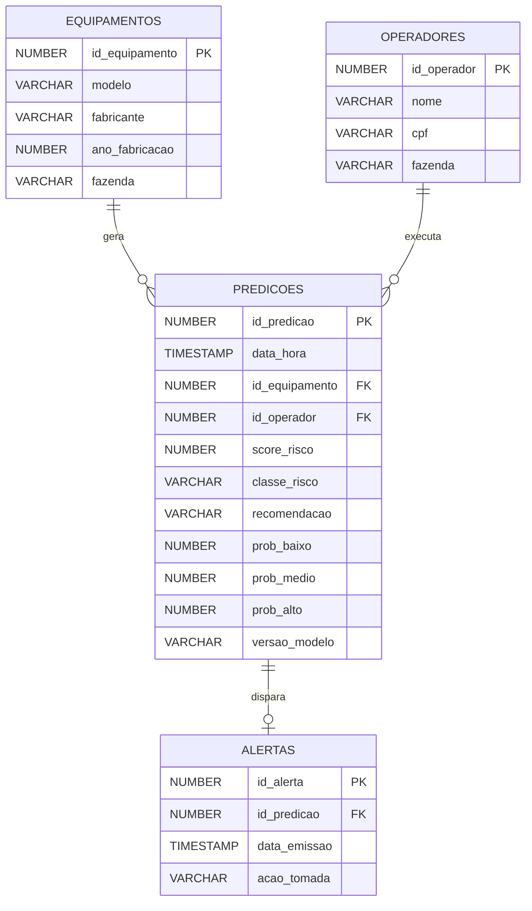
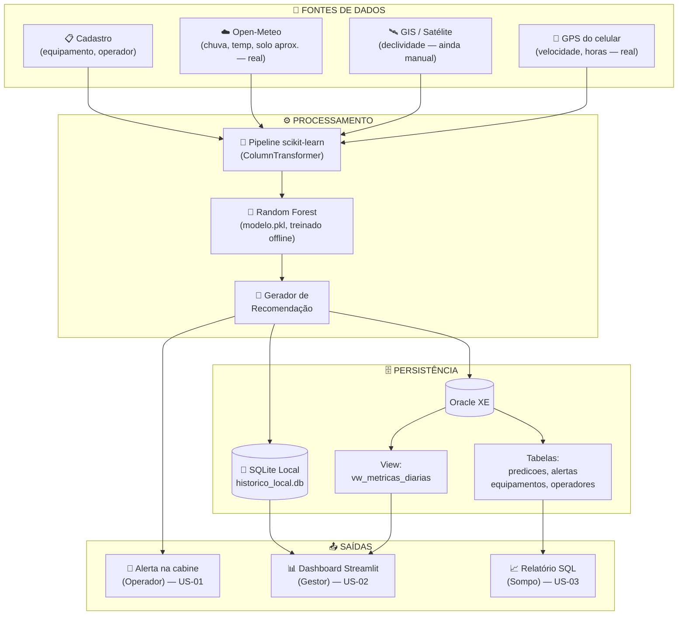

# 🌾 Sompo AgroPredict — Sprint 3

> **Do reativo ao preditivo: prevenção de riscos operacionais em equipamentos agrícolas.**

[](#)
[](#)
[-89.6%25-2C5F2D)](#)
[](#)
[](#)

---

## 📌 Sobre esta entrega

Esta é a **Sprint 3** do Challenge Sompo, na qual a proposta documental da Sprint 2 ganha implementação técnica funcional. As entregas centrais são:

- **Modelo Random Forest treinado e validado** (acurácia 89.6% e F1 macro 81.4% em CV 5-fold)
- **Camada SQL no Oracle XE** para persistir predições e alertas
- **Dashboard Streamlit** funcional, consumindo o modelo e o banco
- **Dataset v2 ampliado** — 1000 linhas, 8 features (de 5 para 8 conforme feedback)
- **User Stories formalizadas** com critérios de aceite Dado/Quando/Então
- **🆕 Telemetria em tempo real** — GPS do celular do operador (velocidade) e API climática Open-Meteo (temperatura, chuva, aproximação de umidade do solo) substituindo os sliders simulados, com fallback manual campo a campo
- **🆕 Persistência dupla** — tabela local SQLite (cresce sozinha, funciona offline) além do Oracle XE (best effort)

### Evolução em relação à Sprint 2

| Aspecto | Sprint 1 | Sprint 2 |
|---|---|---|
| Modelo | Proposto, não implementado | Treinado, validado, exportado (`modelo.pkl`) |
| Dataset | 5 features, exemplo pequeno | **8 features**, **1000 linhas** estratificadas |
| Persistência | Conceitual | **Oracle XE** + **SQLite local** com schema + scripts de ingestão |
| Dashboard | Mockups estáticos | **Streamlit funcional** com inputs reais (GPS + clima em tempo real) |
| User Stories | Implícitas nas personas | **Formalizadas** em Dado/Quando/Então |
| Documentação | README + slides | README v2 + notebook + scripts SQL |


- ✅ 3 User Stories formalizadas (uma por persona) em `docs/user_stories.md` com critérios de aceite Dado/Quando/Então
- ✅ Dataset ampliado de 5 para **8 variáveis** (novas: `temperatura`, `idade_maquina`, `horas_operacao`)
- ✅ Volume ampliado de ~50 para **1000 linhas** com geração estratificada (3 cenários)
- ✅ Velocidade e clima deixaram de ser apenas sliders simulados e passaram a vir de **GPS real** e da **Open-Meteo**

---

## 📑 Sumário

1. [Estrutura do Repositório](#1-estrutura-do-repositório)
2. [Como Executar](#2-como-executar)
3. [Dataset v2](#3-dataset-v2)
4. [Modelo Preditivo](#4-modelo-preditivo)
5. [Camada SQL (Oracle XE)](#5-camada-sql-oracle-xe)
6. [Dashboard Streamlit](#6-dashboard-streamlit)
7. [Arquitetura Consolidada](#7-arquitetura-consolidada)
8. [Limitações Conhecidas](#8-limitações-conhecidas)
9. [User Stories](#9-user-stories)
10. [Resultados e Métricas](#10-resultados-e-métricas)
11. [Próximas Sprints](#11-próximas-sprints)
12. [Vídeo de Apresentação](#12-vídeo-de-apresentação)


---

## 1. Estrutura do Repositório

```
sompo-agropredict/
│
├── README.md                          # Este arquivo
│
├── data/
│   ├── gerar_dataset_v2.py            # Script Python de geração estratificada
│   ├── dataset_v2.csv                 # 1000 linhas, 8 features (dados simulados p/ treino)
│
├── modelo/
│   ├── random_forest.ipynb            # Notebook completo (42 células)
│   └── modelo.pkl                     # Pipeline serializado (preproc + RF)
│
├── sql/
│   ├── schema.sql                     # DDL Oracle XE: 4 tabelas + view + sequences
│   ├── inserir_predicoes.py           # Script de ingestão usando oracledb
│   └── consultas.sql                  # 6 queries de análise
│
├── dashboard/
│   ├── app.py                         # Dashboard Streamlit funcional
│   ├── gps.py                         # 🆕 Captura GPS/velocidade do celular do operador
│   ├── clima.py                       # 🆕 Integração com a API Open-Meteo
│   ├── persistencia.py                # 🆕 Grava em SQLite local + tenta gravar no Oracle
│   └── data/
│       └── historico_local.db         # 🆕 Gerado em runtime — tabela SQLite que cresce sozinha
│
├── docs/
│   └── user_stories.md                # 3 US formalizadas (Dado/Quando/Então)
│
└── prints/                            # Capturas de tela e gráficos
    ├── 01_distribuicao_classes.png
    ├── 02_boxplot_features.png
    ├── 03_correlacao.png
    ├── 04_operacao_vs_risco.png
    ├── 05_matriz_confusao.png
    ├── 06_feature_importance.png
    └── 07_dashboard_baixo.png

---

## 2. Como Executar

### Pré-requisitos

```bash
pip install -r requirements.txt
```

O `requirements.txt` já inclui as dependências de telemetria (`streamlit-js-eval`, `streamlit-autorefresh`, `requests`) além das originais (`pandas`, `scikit-learn`, `streamlit`, `oracledb` etc.).

### Passo 1 — Gerar o dataset (simulado, usado só para treinar o modelo)

```bash
cd data/
python gerar_dataset_v2.py
# Saída: dataset_v2.csv (1000 linhas, distribuição 69/14/18 BAIXO/MEDIO/ALTO)
```

### Passo 2 — Treinar o modelo

```bash
cd modelo/
jupyter notebook random_forest.ipynb
# Executar todas as células → gera modelo.pkl + 6 imagens em ../prints/
```

> O modelo é treinado **uma única vez, offline**, com o dataset simulado acima. A telemetria em tempo real (Passo 4) não retreina o modelo — ela só alimenta o `modelo.pkl` já treinado com dados reais em vez de simulados. Ver seção 8.1 para detalhes.

### Passo 3 — (Opcional) Setup do Oracle XE

```bash
# 1. Conectar no Oracle (Seu usario e senha)
sqlplus system/admin@XE

# 2. Executar schema (cria 4 tabelas, 1 view, 2 sequences, 6 registros seed)
@schema.sql

# 3. Inserir predições no banco (seu usario e senha)
$env:ORACLE_USER="system"
$env:ORACLE_PASSWORD="admin"
$env:ORACLE_DSN="localhost:1521/XE"
python inserir_predicoes.py --n 100
```

> Este passo é **opcional**: o dashboard grava normalmente na tabela SQLite local mesmo sem Oracle configurado (ver seção 6).

### Passo 4 — Rodar o dashboard

```bash
cd dashboard/
streamlit run app.py
# Acessar: http://localhost:8501
```

> O dashboard **funciona com ou sem Oracle**. Sem banco, a gravação continua acontecendo na tabela SQLite local.
>
> Para usar o **GPS e o clima em tempo real**, abra o link no **celular do operador** (não no desktop) — é o navegador mobile que pede permissão de localização e fornece a velocidade real do chip GPS. Sem essa permissão, ou em modo manual, o dashboard funciona igual, só que com sliders.

---

## 3. Dataset v2

### Features (8 variáveis)

| Variável | Tipo | Unidade | Fonte em produção | Status |
|---|---|---|---|---|
| `umidade_solo` | Numérica | % | Aproximação via Open-Meteo (camada 0–1cm) | ⚠️ Aproximado — não é satélite dedicado (ver seção 8) |
| `declividade` | Numérica | % | Mapas GIS / satélite | ⏳ Manual |
| `chuva_24h` | Numérica | mm | Open-Meteo | ✅ Implementado |
| `velocidade` | Numérica | km/h | GPS do celular | ✅ Implementado |
| `status_operacao` | Categórica | — | Input do operador | ✅ Manual por design |
| `temperatura` | Numérica | °C | Open-Meteo | ✅ Implementado |
| `idade_maquina` | Numérica | anos | Cadastro do equipamento | ⏳ Manual |
| `horas_operacao` | Numérica | h | GPS (contador automático, formato `HH:MM`) | ✅ Implementado |

### Justificativa das novas variáveis

- **`temperatura`** — Calor extremo combinado com jornada longa eleva risco de fadiga do operador e superaquecimento mecânico
- **`idade_maquina`** — Máquinas antigas têm probabilidade maior de falha mecânica, especialmente sob uso intenso
- **`horas_operacao`** — Fadiga do operador e desgaste térmico crescem ao longo do dia

Todas as 3 novas variáveis seguem o princípio da Sprint 2: **captáveis por fontes externas à máquina** (celular, cadastro, API), viabilizando adoção em frotas legadas sem telemetria proprietária.

### Geração estratificada

O dataset **de treino** (usado só para gerar o `modelo.pkl`) é gerado em 3 cenários proporcionais para garantir representatividade das classes:

| Cenário | Proporção | Distribuições deslocadas |
|---|---|---|
| **Seguro** | 45% | Umidade baixa, declividade baixa, velocidade moderada |
| **Limite** | 35% | Variáveis em zonas de transição |
| **Crítico** | 20% | Múltiplos fatores adversos sobrepostos |

**Distribuição final das classes:** 45% BAIXO · 35% MÉDIO · 20% ALTO (refletindo a realidade do agro: maioria das operações é segura).

> Importante: esse dataset é **simulado**. Os dados reais capturados pelo GPS/clima em produção (seção 6) alimentam o modelo já treinado, mas não fazem parte do dataset de treino ainda — ver seção 8.1.

---

## 4. Modelo Preditivo

### Random Forest Classifier — justificativa

| Critério | Por que Random Forest |
|---|---|
| **Interações não-lineares** | Captura naturalmente regras como "umidade alta + chuva = atolamento" |
| **Dataset moderado (1000 linhas)** | Tamanho ideal para RF — pequeno demais para deep learning, grande demais para uma árvore única |
| **Features mistas** | Numéricas + categóricas sem necessidade de normalização |
| **Interpretabilidade** | Feature importance nativa → fundamental para seguro e LGPD |

### Hiperparâmetros otimizados (grid search manual de 5 combinações)

```python
RandomForestClassifier(
    n_estimators=300,
    min_samples_split=2,
    min_samples_leaf=2,        # leve regularização
    max_features='sqrt',
    class_weight='balanced',   # compensa desbalanceamento
    random_state=42
)
```

### Pipeline completo

```
Entrada (8 features)
    ↓
ColumnTransformer:
    • numéricas (7) → passthrough
    • status_operacao → OneHotEncoder(drop='first')
    ↓
RandomForestClassifier
    ↓
Saída: classe (BAIXO/MÉDIO/ALTO) + score (0–100) + probabilidades
```

Todo o pipeline é serializado em `modelo.pkl` — o dashboard e o script de ingestão SQL só fazem `joblib.load()`.

> O modelo **não é retreinado em tempo real**. Trocar sliders simulados por GPS/clima reais mudou apenas a origem dos valores que entram no `modelo.predict(...)` — os pesos do Random Forest continuam os mesmos aprendidos no dataset sintético. Detalhes em [seção 8.1](#8-limitações-conhecidas).

---

## 5. Camada SQL (Oracle XE)

### Modelo de dados



### Decisões de design

- **Sequences** (`seq_predicao`, `seq_alerta`) para IDs auto-incrementais
- **Indexes** em `predicoes(data_hora)`, `(classe_risco)`, `(id_equipamento)` para queries do dashboard
- **View `vw_metricas_diarias`** consolidando agregações por dia (alimenta o dashboard)
- **Coluna `versao_modelo`** em `predicoes` para rastreabilidade (LGPD / auditoria)
- **CHECK constraints** garantem integridade (`classe_risco IN ('BAIXO','MEDIO','ALTO')`)

### Queries-chave (`sql/consultas.sql`)

1. Distribuição geral de risco
2. Top 10 predições mais críticas
3. Score médio por equipamento (visão do gestor)
4. Taxa de aderência dos operadores aos alertas (relatório Sompo)
5. Identificação de fatores de risco predominantes
6. Métricas diárias consolidadas

### Gravação a partir do dashboard

Além do script batch `inserir_predicoes.py`, o próprio `dashboard/app.py` agora grava no Oracle a cada ciclo de telemetria (via `persistencia.py`), em modo **best effort**: se a conexão falhar, a predição não é perdida — ela continua sendo salva na tabela SQLite local (ver seção 6).

---

## 6. Dashboard Streamlit

O dashboard (`dashboard/app.py`) é a interface funcional que demonstra o ciclo completo: input → modelo → saída → persistência.

### Funcionalidades

- **Calculadora de risco em tempo real**: inputs automáticos (GPS + clima) ou sliders manuais para as 8 features, predição instantânea
- **Card de resultado** com cor por classe (🟢 / 🟡 / 🔴), score 0–100 e recomendação contextual
- **Probabilidades** de cada classe com barras de progresso
- **Indicadores de risco por variável** (⚠️ Alta / OK) baseados em thresholds do domínio
- **Feature importance** do modelo treinado (transparência das decisões)
- **🆕 Telemetria em tempo real (GPS)**: velocidade capturada via GPS do celular do operador (`gps.py`), priorizando a leitura nativa do chip GPS (`coords.speed`) e caindo para cálculo por distância/tempo (Haversine) quando indisponível. Atualiza a cada **10 segundos**.
- **🆕 Clima em tempo real**: temperatura, chuva das últimas 24h e aproximação de umidade do solo via **Open-Meteo** (`clima.py`), a partir da posição do GPS
- **🆕 Contador automático de horas de operação**, exibido em formato **`HH:MM`**, que soma sozinho enquanto o GPS está conectado e **pausa** (sem "pular" tempo) quando o sinal cai; botão para reiniciar no início de um novo turno
- **🆕 Overrides manuais por campo**: cada variável automática (velocidade, clima, umidade do solo, horas) pode ser assumida manualmente, individualmente, sem precisar desligar a telemetria inteira — cobre o caso do operador esquecer de conectar algum sensor
- **🆕 Persistência dupla**: cada leitura é gravada automaticamente em uma tabela **SQLite local** (`dashboard/data/historico_local.db`, sempre funciona mesmo offline) e, em paralelo, tenta gravar no **Oracle XE** (best effort)
- **Histórico** exibido em abas: tabela local (SQLite, sempre disponível) e Oracle XE (quando conectado)

### Modos de operação

| Modo | Quando | Comportamento |
|---|---|---|
| **Telemetria automática** | Toggle "GPS + clima em tempo real" ligado, permissão de localização concedida | Velocidade, clima e horas de operação vêm de GPS/Open-Meteo, atualizando a cada 10s |
| **Manual (geral)** | Toggle desligado | Todas as variáveis via sliders — modo demo/offline |
| **Manual (por campo)** | Checkbox individual marcado no expander da sidebar | Só aquele campo específico vira slider; os demais continuam automáticos |
| **Com Oracle** | `ORACLE_DSN` configurado e schema criado | Grava e lê histórico do banco, além da tabela local |
| **Sem Oracle** | Conexão indisponível | Grava normalmente na tabela SQLite local; nada é perdido |

### Print do dashboard

Ver `prints/07_dashboard_baixo.png` — cenário em condições seguras (classe BAIXO).

---

## 7. Arquitetura Consolidada



### Mudanças em relação à arquitetura da Sprint 2

- ➕ **Camada de Persistência explicitada** (Oracle XE + SQLite local)
- ➕ **Telemetria real** (GPS + Open-Meteo) substituindo simulação nos inputs de velocidade, temperatura, chuva e horas de operação
- ➕ **View agregada** alimentando o dashboard sem queries pesadas

---

## 8. Limitações Conhecidas

### 8.1 O modelo não é retreinado com os dados reais (ainda)

O `modelo.pkl` continua sendo o mesmo Random Forest treinado **uma única vez, offline**, com o dataset simulado `dataset_v2.csv`. Conectar GPS e clima reais mudou **apenas a origem dos inputs em produção** — os padrões que o modelo reconhece (ex.: "umidade alta + chuva alta → risco de atolamento") ainda vêm inteiramente da simulação, não de dados reais de campo.

A tabela `dashboard/data/historico_local.db` é o embrião de um dataset real: a cada leitura de GPS/clima, o dashboard já registra o resultado localmente. Mas hoje essa tabela não tem **rótulos confirmados** (ex.: sinistros que de fato aconteceram) — sem isso, não é seguro re-treinar o modelo a partir dela ainda. Isso é um passo natural para a Sprint 3.

### 8.2 Variáveis que não são capturadas automaticamente

| Variável | Situação atual | Motivo |
|---|---|---|
| `declividade` | Manual (slider) | Depende de mapa GIS/satélite por talhão — fora do escopo do GPS do celular e da API de clima |
| `umidade_solo` | Aproximação via Open-Meteo (camada 0–1cm do modelo de superfície) | Não é um sensor de solo real nem imagem de satélite|
| `idade_maquina` | Manual (slider) | Depende de integração com o cadastro de equipamento|

### 8.3 Telemetria em tempo real (GPS/clima)

- Geolocalização do navegador exige **HTTPS** em produção (em `localhost` funciona sem certificado).
- `coords.speed` (velocidade nativa do GPS) só costuma vir preenchido em **celulares com GPS ativo e em movimento**; parado ou em navegador desktop, o app cai automaticamente no cálculo por distância/tempo entre leituras (Haversine), que é menos preciso.
- A atualização de posição, velocidade e clima ocorre a cada **10 segundos** — eventos mais rápidos que isso (ex.: uma freada brusca) não são capturados em tempo real.
- O contador automático de `horas_operacao` **pausa** (não zera nem "pula" o tempo desconectado) se o GPS perder sinal, e depende do navegador continuar aberto na sessão — fechar a aba não persiste a contagem entre sessões (por isso existe o botão "Reiniciar contador" no início de cada turno).

### 8.4 Persistência

- A gravação no Oracle é **best effort**: se a conexão falhar, a predição continua sendo salva na tabela SQLite local, mas não há retry automático depois que o Oracle volta a ficar disponível.
- A tabela SQLite local fica no disco de quem está rodando o dashboard — não é compartilhada automaticamente entre operadores/máquinas diferentes (sem sincronização central nesta entrega).


---

### 9. Implementado nesta Sprint

| Controle | Onde | Como |
|---|---|---|
| **Integridade de domínio** | `sql/schema.sql` | `CHECK` constraints garantem que `classe_risco ∈ {BAIXO, MEDIO, ALTO}` e `status_operacao ∈ {Colheita, Deslocamento, Manobra}` — entradas inválidas são rejeitadas pelo banco |
| **Integridade referencial** | `sql/schema.sql` | `FOREIGN KEY` ligando `predicoes` a `equipamentos` e `operadores`; impede predições órfãs |
| **Rastreabilidade de decisão automatizada** | `predicoes.versao_modelo` + `prob_baixo/medio/alto` | Cada predição registra a versão do modelo e as probabilidades — base para auditoria (LGPD art. 20, direito a revisão de decisão automatizada) |
| **Validação de faixas (sanity check)** | `data/gerar_dataset_v2.py` (`np.clip`) | Todas as features são limitadas a faixas fisicamente plausíveis antes de entrar no modelo |
| **Trilha de auditoria de alertas** | tabela `alertas` (`acao_tomada`, `data_acao`) | Registra se o operador respeitou ou ignorou cada alerta — evidência para análise forense de sinistro |
| **Resiliência de persistência** | `dashboard/persistencia.py` | Falha no Oracle não derruba o dashboard nem perde dados — gravação local sempre acontece |


---

## 9. User Stories

Documento completo em [`docs/user_stories.md`](docs/user_stories.md).

| ID | Persona | Resumo |
|---|---|---|
| **US-01** | Operador de Campo | Alerta preventivo em tempo real com sinalização visual + sonora |
| **US-02** | Gestor de Frota | Dashboard tático com ranking de equipamentos e drilldown |
| **US-03** | Analista Sompo | Relatórios de aderência aos alertas e análise forense de sinistros |

Cada US tem **4 critérios de aceite** no formato Dado/Quando/Então, totalizando **12 critérios** rastreáveis aos entregáveis técnicos da Sprint 3.

---

## 10. Resultados e Métricas

### Comparação Baseline × Random Forest

| Modelo | Acurácia (teste) | F1 macro (teste) | Acurácia (CV 5-fold) | F1 macro (CV 5-fold) |
|---|---|---|---|---|
| Logistic Regression (baseline) | 83.2% | 79.3% | — | — |
| **Random Forest (final)** | **89.2%** | **81.7%** | **89.6% (±2.3%)** | **81.4% (±4.8%)** |

> O dataset foi rebalanceado para reforçar a classe MÉDIO (de ~10% para ~14% das amostras), que é a mais difícil por ser fronteiriça entre BAIXO e ALTO. Isso elevou o F1 macro do modelo (de 76% para 81%), tornando-o mais equilibrado entre as três classes — ao custo de ~1 ponto de acurácia global, um trade-off favorável.

### Matriz de Confusão (teste set, n=250)

```
              Predito
Real      BAIXO  MEDIO  ALTO
BAIXO     [162    9      0]
MEDIO     [  6   23      5]
ALTO      [  0    7     38]
```

**Análise:** após o rebalanceamento, a classe MÉDIO acerta **23 de 34 (recall 68%)**, ALTO mantém **38/45 recall (84%)** — crítico no domínio, já que falso negativo de ALTO seria deixar passar uma situação perigosa. Não há confusão entre os extremos (BAIXO↔ALTO = 0 casos), o que é o comportamento desejado: os erros que restam são entre classes adjacentes.

### Feature Importance (top 5)

Detalhes no notebook seção 10. Variáveis com maior peso na decisão:

1. `umidade_solo`
2. `velocidade`
3. `temperatura`
4. `chuva_24h`
5. `declividade`

A justificativa do modelo a uma decisão de classificação ALTO sempre pode ser explicada apontando a combinação das 2–3 variáveis dominantes (transparência ↔ LGPD).

> Nota: essas métricas foram calculadas sobre o dataset **simulado**. Ainda não há avaliação do modelo sobre dados reais capturados via GPS/clima — ver seção 8.1.

---

## 11. Próximas Sprints

| Sprint | Foco | Entregas Principais |
|---|---|---|
| Sprint 1 ✅ | Estrutura inicial e proposta documentada | README, dataset simulado, mockups, vídeo |
| Sprint 2 ✅| Modelo preditivo  | Notebook treinado, SQL Oracle, dashboard funcional, US formalizadas |
| **Sprint 3 ✅** |  integração end-to-end |  telemetria GPS + clima em tempo real |
| Sprint Final |  sensor de solo dedicado, avaliação do modelo com dados reais, RBAC no Oracle | Protótipo completo + apresentação | Sistema integrado, vídeo final|

---

## 12. Vídeo de Apresentação

🎬 **Link do vídeo (Sprint 3):** *[a ser adicionado após gravação]*

Conteúdo de até 5 minutos cobrindo:
1. Evolução em relação à Sprint 2
2. Demonstração do modelo treinado e métricas
3. Tour pelo dashboard Streamlit funcional (incluindo telemetria em tempo real)
4. Estrutura do banco Oracle e integração end-to-end


---

### Tutoria

- **Tutora da Turma A:** Nicolly de Souza ([@nicollycrs](https://github.com/nicollycrs))

---

<div align="center">

**Sompo AgroPredict** · Challenge Sompo × FIAP · Sprint 3

*Em vez de pagar o sinistro, calculamos o risco.*

</div>
