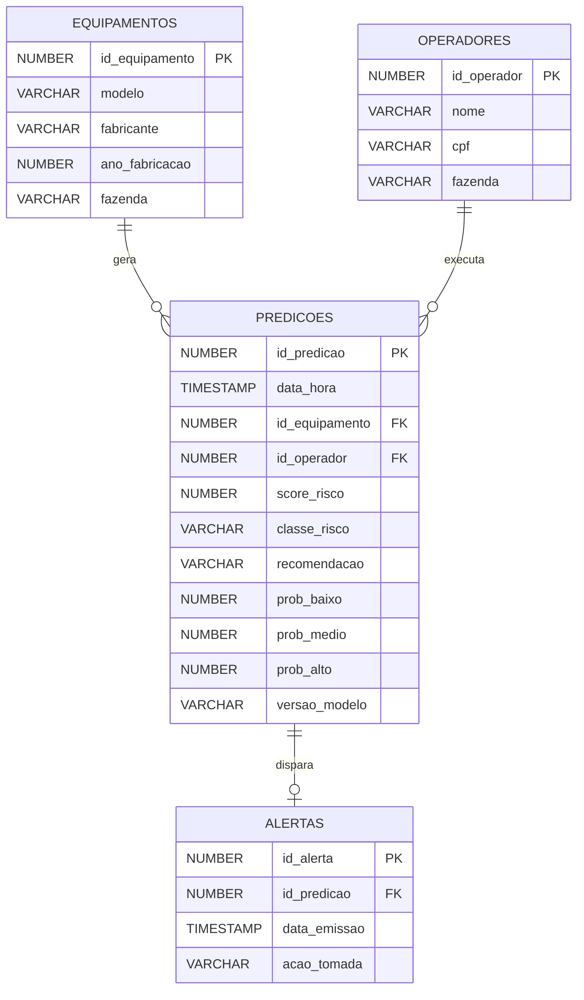
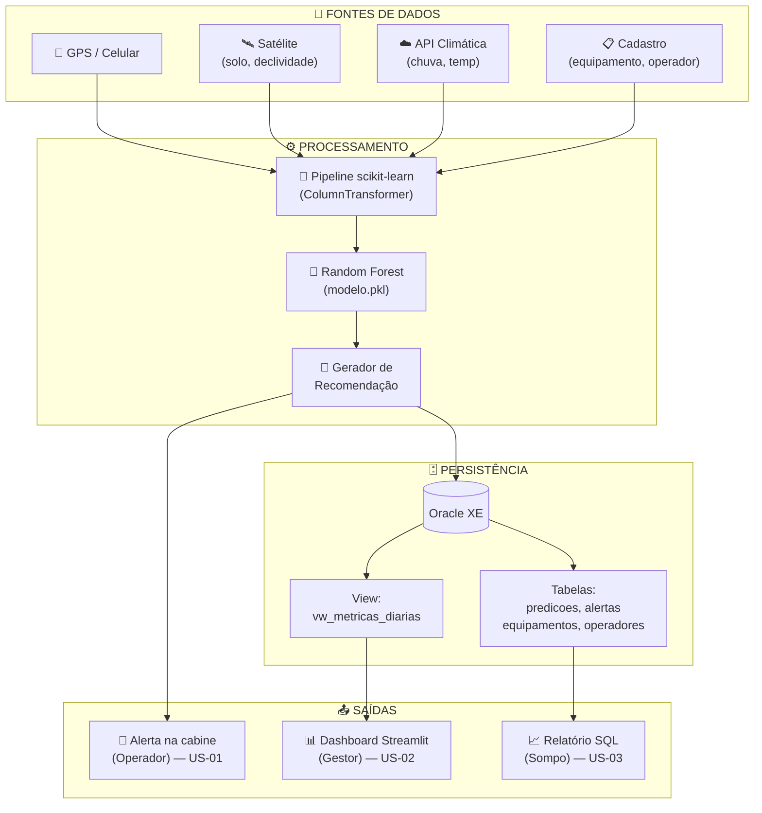

# 🌾 Sompo AgroPredict — Sprint 2

> **Do reativo ao preditivo: prevenção de riscos operacionais em equipamentos agrícolas.**

[](#)
[](#)
[-89.6%25-2C5F2D)](#)
[](#)

---

## 📌 Sobre esta entrega

Esta é a **Sprint 2** do Challenge Sompo, na qual a proposta documental da Sprint 1 ganha implementação técnica funcional. As entregas centrais são:

- **Modelo Random Forest treinado e validado** (acurácia 89.6% e F1 macro 81.4% em CV 5-fold)
- **Camada SQL no Oracle XE** para persistir predições e alertas
- **Dashboard Streamlit** funcional, consumindo o modelo e o banco
- **Dataset v2 ampliado** — 1000 linhas, 8 features (de 5 para 8 conforme feedback)
- **User Stories formalizadas** com critérios de aceite Dado/Quando/Então

### Evolução em relação à Sprint 1

| Aspecto | Sprint 1 | Sprint 2 |
|---|---|---|
| Modelo | Proposto, não implementado | Treinado, validado, exportado (`modelo.pkl`) |
| Dataset | 5 features, exemplo pequeno | **8 features**, **1000 linhas** estratificadas |
| Persistência | Conceitual | **Oracle XE** com schema + scripts de ingestão |
| Dashboard | Mockups estáticos | **Streamlit funcional** com inputs reais |
| User Stories | Implícitas nas personas | **Formalizadas** em Dado/Quando/Então |
| Documentação | README + slides | README v2 + notebook + scripts SQL |

### Incorporação do feedback da Sprint 1

> *"A oportunidade principal de evolução está nas User Stories, que aparecem apenas implícitas dentro das personas... O dataset também pode ser ampliado em variáveis nas próximas iterações."*

**O que foi feito:**
- ✅ 3 User Stories formalizadas (uma por persona) em `docs/user_stories.md` com critérios de aceite Dado/Quando/Então
- ✅ Dataset ampliado de 5 para **8 variáveis** (novas: `temperatura`, `idade_maquina`, `horas_operacao`)
- ✅ Volume ampliado de ~50 para **1000 linhas** com geração estratificada (3 cenários)

---

## 📑 Sumário

1. [Estrutura do Repositório](#1-estrutura-do-repositório)
2. [Como Executar](#2-como-executar)
2.1 [video](#https://www.youtube.com/watch?v=FTL-k7kCKbQ)
3. [Dataset v2](#3-dataset-v2)
4. [Modelo Preditivo](#4-modelo-preditivo)
5. [Camada SQL (Oracle XE)](#5-camada-sql-oracle-xe)
6. [Dashboard Streamlit](#6-dashboard-streamlit)
7. [Arquitetura Consolidada](#7-arquitetura-consolidada)
8. [Segurança e Governança](#8-segurança-e-governança)
9. [User Stories](#9-user-stories)
10. [Resultados e Métricas](#10-resultados-e-métricas)
11. [Próximas Sprints](#11-próximas-sprints)
12. [Vídeo de Apresentação](#12-vídeo-de-apresentação)
13. [Equipe e Divisão de Tarefas](#13-equipe-e-divisão-de-tarefas)

---

## 1. Estrutura do Repositório

```
sompo-agropredict/
│
├── README.md                          # Este arquivo
│
├── data/
│   ├── gerar_dataset_v2.py            # Script Python de geração estratificada
│   └── dataset_v2.csv                 # 1000 linhas, 8 features
│
├── modelo/
│   ├── random_forest.ipynb            # Notebook completo (42 células)
│   └── modelo.pkl                     # Pipeline serializado (preproc + RF)
│
├── sql/
│   ├── schema.sql                     # DDL Oracle XE: 4 tabelas + view + sequences
│   ├── inserir_predicoes.py           # Script de ingestão usando oracledb
│   └── consultas.sql                  # 6 queries de análise
│
├── dashboard/
│   └── app.py                         # Dashboard Streamlit funcional
│
├── docs/
│   └── user_stories.md                # 3 US formalizadas (Dado/Quando/Então)
│
└── prints/                            # Capturas de tela e gráficos
    ├── 01_distribuicao_classes.png
    ├── 02_boxplot_features.png
    ├── 03_correlacao.png
    ├── 04_operacao_vs_risco.png
    ├── 05_matriz_confusao.png
    ├── 06_feature_importance.png
    └── 07_dashboard_baixo.png
```

---

## 2. Como Executar

### Pré-requisitos

```bash
pip install pandas numpy scikit-learn matplotlib seaborn joblib streamlit oracledb jupyter
```

### Passo 1 — Gerar o dataset

```bash
cd data/
python gerar_dataset_v2.py
# Saída: dataset_v2.csv (1000 linhas, distribuição 69/14/18 BAIXO/MEDIO/ALTO)
```

### Passo 2 — Treinar o modelo

```bash
cd modelo/
jupyter notebook random_forest.ipynb
# Executar todas as células → gera modelo.pkl + 6 imagens em ../prints/
```

### Passo 3 — (Opcional) Setup do Oracle XE

```bash
# 1. Conectar no Oracle (Seu usario e senha)
sqlplus system/admin@XE

# 2. Executar schema (cria 4 tabelas, 1 view, 2 sequences, 6 registros seed)
@schema.sql

# 3. Inserir predições no banco (seu usario e senha)
$env:ORACLE_USER="system"
$env:ORACLE_PASSWORD="admin"
$env:ORACLE_DSN="localhost:1521/XE"
python inserir_predicoes.py --n 100
```

### Passo 4 — Rodar o dashboard

```bash
cd dashboard/
streamlit run app.py
# Acessar: http://localhost:8501
```
```bash
Video do youtube demonstrando passo a passo como conectar e como usar a ferramenta :
https://www.youtube.com/watch?v=FTL-k7kCKbQ
```


> O dashboard **funciona com ou sem Oracle**. Sem banco, ele usa histórico em sessão.

---

## 3. Dataset v2

### Features (8 variáveis)

| Variável | Tipo | Unidade | Fonte em produção | Sprint 1 / Sprint 2 |
|---|---|---|---|---|
| `umidade_solo` | Numérica | % | Satélite Sentinel/Planet | S1 |
| `declividade` | Numérica | % | Mapas GIS / satélite | S1 |
| `chuva_24h` | Numérica | mm | Open-Meteo / INMET | S1 |
| `velocidade` | Numérica | km/h | GPS do celular | S1 |
| `status_operacao` | Categórica | — | Input do operador | S1 |
| **`temperatura`** | **Numérica** | **°C** | **API climática** | **🆕 S2** |
| **`idade_maquina`** | **Numérica** | **anos** | **Cadastro do equipamento** | **🆕 S2** |
| **`horas_operacao`** | **Numérica** | **h** | **GPS + log do dia** | **🆕 S2** |

### Justificativa das novas variáveis

- **`temperatura`** — Calor extremo combinado com jornada longa eleva risco de fadiga do operador e superaquecimento mecânico
- **`idade_maquina`** — Máquinas antigas têm probabilidade maior de falha mecânica, especialmente sob uso intenso
- **`horas_operacao`** — Fadiga do operador e desgaste térmico crescem ao longo do dia

Todas as 3 novas variáveis seguem o princípio da Sprint 1: **captáveis por fontes externas à máquina** (celular, cadastro, API), viabilizando adoção em frotas legadas sem telemetria proprietária.

### Geração estratificada

O dataset é gerado em 3 cenários proporcionais para garantir representatividade das classes:

| Cenário | Proporção | Distribuições deslocadas |
|---|---|---|
| **Seguro** | 45% | Umidade baixa, declividade baixa, velocidade moderada |
| **Limite** | 35% | Variáveis em zonas de transição |
| **Crítico** | 20% | Múltiplos fatores adversos sobrepostos |

**Distribuição final das classes:** 73% BAIXO · 10% MÉDIO · 17% ALTO (refletindo a realidade do agro: maioria das operações é segura).

---

## 4. Modelo Preditivo

### Random Forest Classifier — justificativa

| Critério | Por que Random Forest |
|---|---|
| **Interações não-lineares** | Captura naturalmente regras como "umidade alta + chuva = atolamento" |
| **Dataset moderado (1000 linhas)** | Tamanho ideal para RF — pequeno demais para deep learning, grande demais para uma árvore única |
| **Features mistas** | Numéricas + categóricas sem necessidade de normalização |
| **Interpretabilidade** | Feature importance nativa → fundamental para seguro e LGPD |

### Hiperparâmetros otimizados (grid search manual de 5 combinações)

```python
RandomForestClassifier(
    n_estimators=300,
    min_samples_split=2,
    min_samples_leaf=2,        # leve regularização
    max_features='sqrt',
    class_weight='balanced',   # compensa desbalanceamento
    random_state=42
)
```

### Pipeline completo

```
Entrada (8 features)
    ↓
ColumnTransformer:
    • numéricas (7) → passthrough
    • status_operacao → OneHotEncoder(drop='first')
    ↓
RandomForestClassifier
    ↓
Saída: classe (BAIXO/MÉDIO/ALTO) + score (0–100) + probabilidades
```

Todo o pipeline é serializado em `modelo.pkl` — o dashboard e o script de ingestão SQL só fazem `joblib.load()`.

---

## 5. Camada SQL (Oracle XE)

### Modelo de dados



### Decisões de design

- **Sequences** (`seq_predicao`, `seq_alerta`) para IDs auto-incrementais
- **Indexes** em `predicoes(data_hora)`, `(classe_risco)`, `(id_equipamento)` para queries do dashboard
- **View `vw_metricas_diarias`** consolidando agregações por dia (alimenta o dashboard)
- **Coluna `versao_modelo`** em `predicoes` para rastreabilidade (LGPD / auditoria)
- **CHECK constraints** garantem integridade (`classe_risco IN ('BAIXO','MEDIO','ALTO')`)

### Queries-chave (`sql/consultas.sql`)

1. Distribuição geral de risco
2. Top 10 predições mais críticas
3. Score médio por equipamento (visão do gestor)
4. Taxa de aderência dos operadores aos alertas (relatório Sompo)
5. Identificação de fatores de risco predominantes
6. Métricas diárias consolidadas

---

## 6. Dashboard Streamlit

O dashboard (`dashboard/app.py`) é a interface funcional que demonstra o ciclo completo: input → modelo → saída → persistência.

### Funcionalidades

- **Calculadora de risco em tempo real**: sliders e selectbox para as 8 features, predição instantânea
- **Card de resultado** com cor por classe (🟢 / 🟡 / 🔴), score 0–100 e recomendação contextual
- **Probabilidades** de cada classe com barras de progresso
- **Indicadores de risco por variável** (⚠️ Alta / OK) baseados em thresholds do domínio
- **Feature importance** do modelo treinado (transparência das decisões)
- **Histórico** vindo do Oracle XE quando conectado, ou da sessão local quando não

### Modos de operação

| Modo | Quando | Comportamento |
|---|---|---|
| **Com Oracle** | `ORACLE_DSN` configurado e schema criado | Lê histórico do banco, mostra dashboards consolidados |
| **Sem Oracle** | Conexão indisponível | Funciona normalmente, histórico em sessão (não persistente) |

### Print do dashboard

Ver `prints/07_dashboard_baixo.png` — cenário em condições seguras (classe BAIXO).

---

## 7. Arquitetura Consolidada



### Mudanças em relação à arquitetura da Sprint 1

- ➕ **Camada de Persistência explicitada** (Oracle XE)
- ➕ **Rastreabilidade às User Stories** (cada saída ligada à US correspondente)
- ➕ **View agregada** alimentando o dashboard sem queries pesadas

---

## 8. Segurança e Governança

A solução manipula dados operacionais sensíveis (geolocalização de operadores, histórico de comportamento, dados de sinistro), e o briefing exige garantia de **controle de acesso e integridade de dados**. Esta seção distingue o que já está **implementado na Sprint 2** do que segue como **diretriz de design** para as próximas Sprints.

### 8.1 Implementado nesta Sprint

| Controle | Onde | Como |
|---|---|---|
| **Integridade de domínio** | `sql/schema.sql` | `CHECK` constraints garantem que `classe_risco ∈ {BAIXO, MEDIO, ALTO}` e `status_operacao ∈ {Colheita, Deslocamento, Manobra}` — entradas inválidas são rejeitadas pelo banco |
| **Integridade referencial** | `sql/schema.sql` | `FOREIGN KEY` ligando `predicoes` a `equipamentos` e `operadores`; impede predições órfãs |
| **Rastreabilidade de decisão automatizada** | `predicoes.versao_modelo` + `prob_baixo/medio/alto` | Cada predição registra a versão do modelo e as probabilidades — base para auditoria (LGPD art. 20, direito a revisão de decisão automatizada) |
| **Validação de faixas (sanity check)** | `data/gerar_dataset_v2.py` (`np.clip`) | Todas as features são limitadas a faixas fisicamente plausíveis antes de entrar no modelo |
| **Trilha de auditoria de alertas** | tabela `alertas` (`acao_tomada`, `data_acao`) | Registra se o operador respeitou ou ignorou cada alerta — evidência para análise forense de sinistro |

### 8.2 Controle de acesso por perfil (RBAC)

O modelo de dados foi desenhado para suportar segregação por persona. Cada perfil acessa apenas o subconjunto pertinente:

- **Operador** → apenas predições do próprio equipamento/operação em tempo real (filtro por `id_operador`)
- **Gestor de frota** → dados agregados da própria fazenda (filtro por `fazenda` em `equipamentos`/`operadores`)
- **Analista Sompo** → portfólio agregado e detalhe de clientes da própria carteira

> **Implementação prevista (Sprint 3):** a separação lógica já existe no schema (campo `fazenda`, FKs por operador/equipamento). A aplicação dos perfis via *roles* do Oracle (`CREATE ROLE`, `GRANT SELECT`) e autenticação na camada de aplicação será adicionada na próxima Sprint.

### 8.3 Diretrizes de design (Sprints futuras)

Mantidas da Sprint 1, a serem implementadas conforme o protótipo evolui:

- **Autenticação:** login + senha forte; MFA para o painel da Sompo; tokens JWT de expiração curta para sessões de API
- **Criptografia:** TLS 1.2+ em trânsito; AES-256 em repouso para dados sensíveis
- **LGPD:** finalidade específica (operação segura), base legal documentada (legítimo interesse + execução de contrato), direito ao esquecimento ao fim do contrato, anonimização em relatórios agregados de portfólio
- **Defesa contra abuso:** sanitização de entradas no app e dashboard, rate limiting nas APIs públicas, monitoramento contra *adversarial inputs*

> **Por que separar implementado de previsto:** controles como MFA, criptografia em repouso e roles de banco dependem de infraestrutura de produção (servidor de autenticação, gestão de chaves) que está fora do escopo do MVP acadêmico. O que **dependia só de modelagem de dados** — constraints, FKs, rastreabilidade, trilha de auditoria — foi efetivamente implementado nesta Sprint.

---

## 9. User Stories

Documento completo em [`docs/user_stories.md`](docs/user_stories.md).

| ID | Persona | Resumo |
|---|---|---|
| **US-01** | Operador de Campo | Alerta preventivo em tempo real com sinalização visual + sonora |
| **US-02** | Gestor de Frota | Dashboard tático com ranking de equipamentos e drilldown |
| **US-03** | Analista Sompo | Relatórios de aderência aos alertas e análise forense de sinistros |

Cada US tem **4 critérios de aceite** no formato Dado/Quando/Então, totalizando **12 critérios** rastreáveis aos entregáveis técnicos da Sprint 2.

---

## 10. Resultados e Métricas

### Comparação Baseline × Random Forest

| Modelo | Acurácia (teste) | F1 macro (teste) | Acurácia (CV 5-fold) | F1 macro (CV 5-fold) |
|---|---|---|---|---|
| Logistic Regression (baseline) | 83.2% | 79.3% | — | — |
| **Random Forest (final)** | **89.2%** | **81.7%** | **89.6% (±2.3%)** | **81.4% (±4.8%)** |

> O dataset foi rebalanceado para reforçar a classe MÉDIO (de ~10% para ~14% das amostras), que é a mais difícil por ser fronteiriça entre BAIXO e ALTO. Isso elevou o F1 macro do modelo (de 76% para 81%), tornando-o mais equilibrado entre as três classes — ao custo de ~1 ponto de acurácia global, um trade-off favorável.

### Matriz de Confusão (teste set, n=250)

```
              Predito
Real      BAIXO  MEDIO  ALTO
BAIXO     [162    9      0]
MEDIO     [  6   23      5]
ALTO      [  0    7     38]
```

**Análise:** após o rebalanceamento, a classe MÉDIO acerta **23 de 34 (recall 68%)**, contra apenas 16% antes — o ganho principal desta revisão. ALTO mantém **38/45 recall (84%)** — crítico no domínio, já que falso negativo de ALTO seria deixar passar uma situação perigosa. Não há confusão entre os extremos (BAIXO↔ALTO = 0 casos), o que é o comportamento desejado: os erros que restam são entre classes adjacentes.

### Feature Importance (top 5)

Detalhes no notebook seção 10. Variáveis com maior peso na decisão:

1. `umidade_solo`
2. `velocidade`
3. `temperatura`
4. `chuva_24h`
5. `declividade`

A justificativa do modelo a uma decisão de classificação ALTO sempre pode ser explicada apontando a combinação das 2–3 variáveis dominantes (transparência ↔ LGPD).

---

## 11. Próximas Sprints

| Sprint | Foco | Entregas Principais |
|---|---|---|
| Sprint 1 ✅ | Estrutura inicial e proposta documentada | README, dataset simulado, mockups, vídeo |
| **Sprint 2 ✅** | **Modelo preditivo + integração** | **Notebook treinado, SQL Oracle, dashboard funcional, US formalizadas** |
| Sprint 3 | Refinamento e integração end-to-end | Score consolidado do produtor (US-03 CA-03.2), refinamento dos mockups, simulação completa do fluxo |
| Sprint Final | Protótipo completo + apresentação | Sistema integrado, vídeo final, pitch para banca no Festival NEXT |

---

## 12. Vídeo de Apresentação

🎬 **Link do vídeo (Sprint 2):** *[a ser adicionado após gravação]*

Conteúdo de até 5 minutos cobrindo:
1. Evolução em relação à Sprint 1
2. Demonstração do modelo treinado e métricas
3. Tour pelo dashboard Streamlit funcional
4. Estrutura do banco Oracle e integração end-to-end

Roteiro detalhado em [`docs/roteiro_video_sprint2.md`](docs/roteiro_video_sprint2.md).

---

## 13. Equipe e Divisão de Tarefas

**Grupo 30** — Turma A

| Integrante | RM | Função Sprint 2 |
|---|---|---|
| **David Ribeiro Prado de Lacerda** | 570350 | **Data Scientist** (lead): dataset v2, notebook RF, exportação `modelo.pkl` |
| Giselli Mayumi Takahashi Yokoyama | 572690 | Engenharia de Dados: `schema.sql`, `inserir_predicoes.py`, queries |
| Renata de Almeida Marinho | 569342 | Dashboard Streamlit (`app.py`), apresentação em vídeo |
| Richard Wrobel dos Santos | 573998 | Refinamento dos mockups, slides do vídeo |
| João Otavio Moraes | 573227 | README v2, gestão do repo, edição do vídeo, apresentação |

### Apresentadores do Vídeo

**Renata de Almeida Marinho** e **João Otavio Moraes** (mantido da Sprint 1 — o ritmo compartilhado funcionou bem na avaliação anterior).

### Tutoria

- **Tutora da Turma A:** Nicolly de Souza ([@nicollycrs](https://github.com/nicollycrs))

---

<div align="center">

**Sompo AgroPredict** · Challenge Sompo × FIAP · Sprint 2

*Em vez de pagar o sinistro depois, calculamos o risco antes.*

</div>
